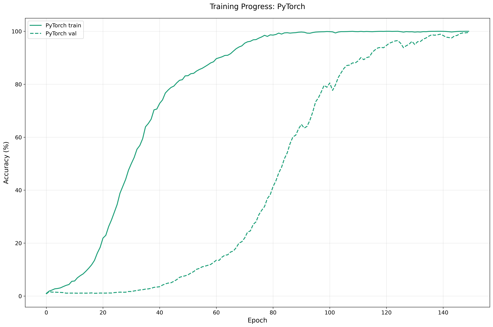

# PyTorch Grokking Implementation

This is a PyTorch implementation of the grokking phenomenon, where
neural networks exhibit a phase transition in generalization
performance during training.

**NOTE: this repo is a Pytorch port of the Grokking Modular Arithmetic - written in MLX by [Jason Stock](https://github.com/stockeh) - available on [https://github.com/stockeh/mlx-grokking](https://github.com/stockeh/mlx-grokking)**

## Overview

The implementation includes:
- Transformer-based architecture with RMSNorm and RoPE
- Customizable model parameters (depth, dimensions, heads)
- Learning rate warmup scheduler
- Training progress visualization

## Example Training Progress

Below is an example of the grokking phenomenon, where the model suddenly "groks" the underlying pattern and generalizes well to the test set:



## Usage

```bash
python main.py [--operation /] [--prime 97] [--train-fraction 0.5] [--depth 2] [--dim 128] [--heads 1] [--dropout 0.2] [--epochs 150] [--batch-size 512] [--lr 1e-3] [--weight-decay 1.0] [--beta1 0.9] [--beta2 0.98] [--warmup 10]
```

## Architecture

The model uses:
- Transformer architecture with causal attention
- RMSNorm for layer normalization
- Rotary Position Embeddings (RoPE)
- AdamW optimizer with weight decay
- Learning rate warmup schedule

## Requirements

- PyTorch
- NumPy
- Matplotlib
- tqdm
